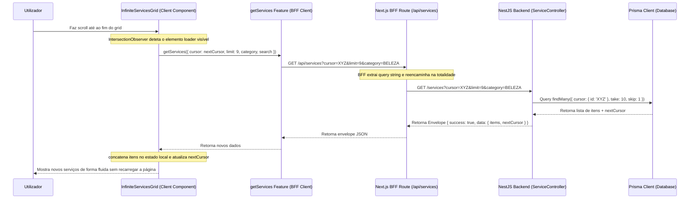

# Fluxo de Paginação por Cursor e Rolagem Infinita no Qcena (BFF Architecture)

Este documento explica de forma detalhada o fluxo de paginação baseada em cursor e **Infinite Scroll (Rolagem Infinita)** implementado na plataforma **Qcena**, cobrindo o percurso completo desde as páginas do Frontend até às consultas na base de dados Prisma do Backend.

---

## 🗺️ Visão Geral do Fluxo



---

## 🛠️ Passo-a-Passo da Implementação

### 1. Componente de Scroll Infinito (`InfiniteServicesGrid.tsx`)
Criámos um componente interativo sob o paradigma `"use client"`, localizado em:
`web/frontend/src/components/search/infinite-services-grid.tsx`

**Como funciona:**
- Recebe a lista inicial de serviços e o `nextCursor` provenientes do Server Component.
- Mantém um estado reativo local para a lista completa de `items` e o cursor atual da página seguinte (`nextCursor`).
- Utiliza um **`IntersectionObserver`** puro (para manter a aplicação leve e independente de pacotes pesados) ancorado a uma div de rodapé.
- Quando o rodapé entra no campo visual do utilizador durante o scroll:
  1. Ativa o estado de `loading` e exibe um spinner animado premium.
  2. Executa um pedido assíncrono ao BFF solicitando o lote seguinte (`limit: 9`).
  3. Ao receber a resposta, concatena os novos serviços aos anteriores e atualiza o `nextCursor`.
- Trata da re-inicialização do estado caso o utilizador mude de categoria ou termo de busca na barra superior (através de um hook `useEffect` reativo a `initialServices`).

---

### 2. Integração nas Páginas de Pesquisa
As duas vistas principais de pesquisa utilizam agora este componente para carregar o primeiro lote de forma ultra-rápida no servidor (SSR) e os lotes subsequentes sob demanda no cliente:
- **Pesquisa Geral:** `web/frontend/src/app/(public)/search/page.tsx`
- **Por Categoria:** `web/frontend/src/app/(public)/search/[collection]/page.tsx`

```typescript
// Carrega o primeiro lote instantaneamente (SSR)
const servicesResponse = await getServices({
  search: searchValue,
  cursor,
  limit: 9,
});

...

return (
  <InfiniteServicesGrid
    initialServices={services.items}
    initialNextCursor={services.nextCursor}
    searchParams={params ?? {}}
  />
);
```

---

### 3. Encaminhamento do BFF no Frontend (`get-services.feat.ts` & `/api/services/route.ts`)
- **BFF Route Handler (`/api/services/route.ts`)**: 
  > [!IMPORTANT]
  > Anteriormente, os parâmetros da query string eram descartados nesta rota.
  > Agora, extraímos todos os parâmetros de `request.url` e os reencaminhamos de forma transparente ao backend NestJS.

```typescript
const { searchParams } = new URL(request.url);
const backendUrl = `${process.env.NEXT_PUBLIC_API_URL}/services?${searchParams.toString()}`;
```

---

### 4. Prisma Repository Layer (`service-prisma.repo.ts`)
A query ao Prisma utiliza paginação baseada em cursor para máxima performance:

```typescript
const limit = filter.limit;
const take = limit + 1; // Busca 1 item a mais para determinar o nextCursor

const services = await this.prisma.service.findMany({
  where,
  take,
  cursor: filter.cursor ? { id: filter.cursor } : undefined,
  skip: filter.cursor ? 1 : 0, // Ignora o cursor em si para trazer apenas os seguintes
  orderBy: { createdAt: 'desc' },
});

// Determina se há uma página seguinte
const hasMore = services.length > limit;
const data = hasMore ? services.slice(0, limit) : services;
const nextCursor = hasMore ? data[data.length - 1].id : null;
```

---

## 💎 Benefícios desta Abordagem

1. **UX Incrível:** O utilizador navega de forma contínua e natural sem a interrupção visual de botões de paginação tradicionais.
2. **Performance Escalável:** Ao contrário da paginação tradicional (`offset`/`skip`), a paginação por cursor mantém uma velocidade de consulta constante ($O(1)$ index lookup) na base de dados, independentemente de estarmos na primeira ou na milésima página de resultados.
3. **Preservação de Estado:** Se o utilizador partilhar o URL de uma página com um cursor específico (ex: `?cursor=cm9x...`), a plataforma renderiza esse segmento imediatamente.
